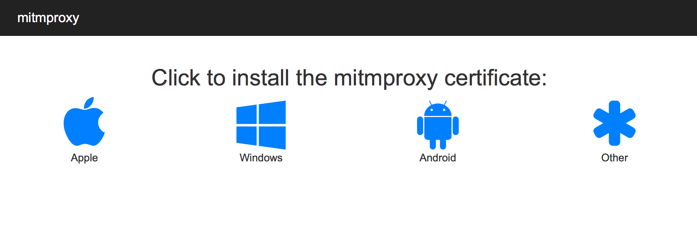

## 部署安装
```bash
docker pull mocklite
```

```bash
docker run -d --name mocklite --restart=always \
-v `pwd`/db:/usr/src/db \
-v `pwd`/mitmproxy:/root/.mitmproxy \
-p 80:80 \
-p 8888:8888 \
mocobk/mocklite
```

* ``-v `pwd`/db:/usr/src/db``  持久化数据库
* ``-v `pwd`/mitmproxy:/root/.mitmproxy``  持久化 HTTPS 证书秘钥
* `-p 80:80`  映射 web 管理地址端口为 80
* `-p 8888:8888`  映射代理服务器端口为 8888

!> 假如你部署的服务器 IP 为 172.22.102.102，管理后台端口映射为 80，代理服务端口映射为 8888, 那么启动后可以访问 [http://172.22.102.102]()来打开 web 配置后台，
在你的浏览器或手机端配置代理 172.22.102.102:8888 来使用 Mock 拦截。

[更多详情](https://github.com/mocobk/mocklite)

## HTTPS 证书安装
如果你 Mock 拦截的是 HTTPS 协议接口，那么就必须先安装 HTTPS 证书。MockLite 代理服务采用 mitmproxy 来实现，
所以安装证书也非常简单：
1. 让你的设备配置代理服务，代理地址和端口根据 MockLite 部署而定，如上面的 172.22.102.102:8888
2. 配置好代理后使用浏览器访问 [http://mitm.it](http://mitm.it)，当出现下方页面时表示正常

3. 根据你的设备类型选择一种证书安装
4. 如遇到问题，请查看[文档](https://docs.mitmproxy.org/stable/concepts-certificates/)


安装mitmproxy证书的最简单方法是使用内置的证书安装应用程序。为此，只需启动mitmproxy并使用正确的代理设置配置目标设备。现在，在设备上启动浏览器，并访问魔术域mitm.it。您应该会看到以下内容：

## 创建项目
在 MockLite Web 管理后台中选择项目页，点击 “+” 可以新增一个项目。


> 你可以选择不同的卡片颜色以快速区分多个项目。

## 创建 Mock 接口拦截数据


原接口 https://appi.kuwo.cn/api/wechat/v2/home 数据
```json
{
  "code": 0,
  "msg": "首页榜单歌单加载成功",
  "data": [
    {
      "type_id": "16",
      "type": "hotSong",
      "label": "热门音乐",
      "pub": "2020-10-13",
      "pic": "https://img4.kuwo.cn/star/albumcover/500/73/91/1572221806.jpg",
      "pic_icon": "",
      "pic_bg": "https://h5static.kuwo.cn/m/79a943e0/rank-bg-rege.png",
      "pic_title": "https://h5static.kuwo.cn/m/79a943e0/rank-title-rege.png",
      "nav_color": "#a455ff",
      "child": [
        {
          "title": "游山恋",
          "album": "游山恋",
          "artist": "海伦",
          "id": 141494937,
          "pay": "16515324",
          "pic": "https://img4.kuwo.cn/star/albumcover/500/73/91/1572221806.jpg",
          "online": 1
        },
        {
          "title": "忘川彼岸",
          "album": "忘川彼岸",
          "artist": "零一九零贰",
          "id": 145215536,
          "pay": "16515324",
          "pic": "https://img3.kuwo.cn/star/albumcover/500/64/90/567086849.jpg",
          "online": 1
        },
        {
          "title": "笑纳",
          "album": "笑纳",
          "artist": "花僮",
          "id": 148370024,
          "pay": "16515324",
          "pic": "https://img2.kuwo.cn/star/albumcover/500/31/75/3644152316.jpg",
          "online": 1
        },
      ...
```
Mock 拦截后响应数据模板
```json
{
  "code": 0,
  "msg": "首页榜单歌单加载成功",
  "data": [
    {
      "type_id": "16",
      "type": "hotSong",
      "label": "热门音乐",
      "pub": "2020-10-13",
      "pic": "https://img4.kuwo.cn/star/albumcover/500/73/91/1572221806.jpg",
      "pic_icon": "",
      "pic_bg": "https://h5static.kuwo.cn/m/79a943e0/rank-bg-rege.png",
      "pic_title": "https://h5static.kuwo.cn/m/79a943e0/rank-title-rege.png",
      "nav_color": "#a455ff",
      "child|5": [
        {
          "title": "游山恋",
          "album": "游山恋",
          "artist": "海伦",
          "id": 141494937,
          "pay": "16515324",
          "pic": "@image('200x200', '测试')",
          "online": 1
        }
      ]
    }
  ]
}
```
对比我们启动 Mock 拦截前后的效果，发现接口数据已发生变更


当我们想正常调用接口时，我们只需关闭接口拦截 Mock 状态 或 取消客户端代理即可。


## 服务管理和日志
在顶部菜单栏有服务管理面板入口


进入服务面板后可以管理各个服务的状态和实时查看日志


